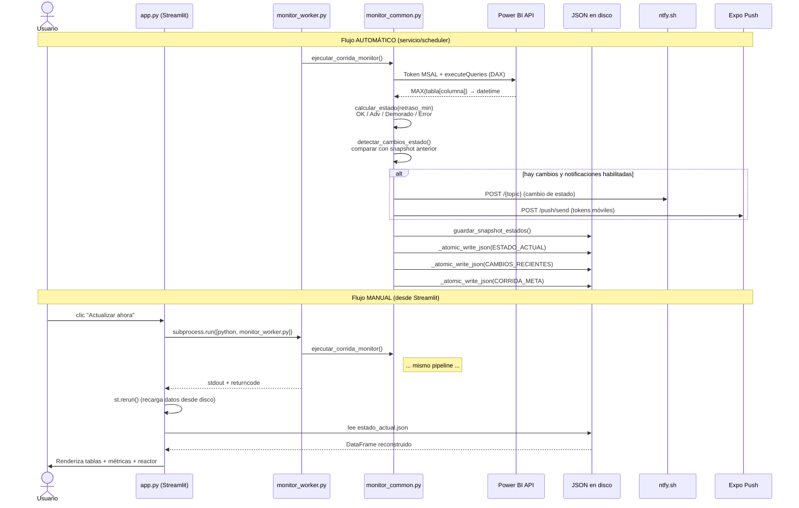

# Mapa de Arquitectura — Dashboard Control

> Visualización de componentes, flujo de datos y dependencias del monitor de tableros Power BI.

---

## 1. Diagrama de componentes (vista de archivos)

```mermaid
graph TB
    subgraph Configuracion["⚙️ Configuración"]
        CSV["config_tableros.csv<br/>23 tableros con workspace/dataset/tabla/columna"]
        ENV[".env / .env.example<br/>Variables de entorno (ntfy, Expo, timeouts)"]
    end

    subgraph Auth["🔐 Autenticación MSAL"]
        CACHE["token_cache.bin<br/>Token serializado de Azure AD"]
        AUTH_PY["auth_test.py<br/>Login interactivo (device flow)"]
    end

    subgraph Worker_Backend["⚙️ Worker / Backend"]
        MONITOR_COMMON["monitor_common.py<br/>Core: consulta PBI, estados, notificaciones, persistencia"]
        MONITOR_WORKER["monitor_worker.py<br/>CLI entrypoint: lanza corrida completa"]
    end

    subgraph Frontend["🖥️ Frontend Streamlit"]
        APP["app.py<br/>UI: tablas, métricas, reactor visual, controles"]
    end

    subgraph API_Movil["📱 API Push Móvil"]
        PUSH_SERVER["mobile_push_server.py<br/>HTTP embebido: registro de tokens Expo"]
        PUSH_API["mobile_push_api.py<br/>Entrypoint dedicado (wrapper trivial)"]
        TOKENS["mobile_push_tokens.json<br/>Tokens registrados de dispositivos"]
    end

    subgraph Scripts_Test["🧪 Scripts de utilidad / test"]
        T_LOGIN["test_login.py<br/>Device flow sin cache"]
        T_EXEC["test_execute_query.py<br/>Prueba executeQueries"]
        T_COB["test_cobranzas_query.py<br/>Prueba con tabla Cobranzas"]
        T_REFRESH["test_refresh_history.py<br/>Historial de refrescos"]
        T_DATASETS["list_datasets.py<br/>Listar datasets de workspace"]
        T_GROUPS["list_groups.py<br/>Listar workspaces"]
    end

    subgraph Persistencia["💾 Persistencia local (JSON)"]
        ESTADO["estado_actual.json<br/>Snapshot actual de todos los tableros"]
        SNAPSHOT["estado_tableros_snapshot.json<br/>Estado anterior (para detectar cambios)"]
        CAMBIOS["cambios_recientes.json<br/>Transiciones de estado detectadas"]
        META["corrida_monitor_meta.json<br/>Metadata de última corrida"]
        PREF["ntfy_push_pref.json<br/>Toggles de notificación (user)"]
    end

    subgraph Notificaciones["🔔 Canales de alerta"]
        NTFY["ntfy.sh<br/>Push HTTP (topic)"]
        EXPO["Expo Push API<br/>Notificaciones móviles (tokens)"]
    end

    subgraph Externo["☁️ Microsoft Power BI"]
        PBI_API["Power BI REST API<br/>executeQueries / refreshes"]
    end

    %% Flujo de datos
    CSV -->|lee| MONITOR_COMMON
    ENV -->|variables| MONITOR_COMMON
    ENV -->|variables| APP
    CACHE -->|deserialize| MONITOR_COMMON
    CACHE -->|deserialize| AUTH_PY
    AUTH_PY -->|write| CACHE

    MONITOR_COMMON -->|ejecuta corrida| MONITOR_WORKER
    MONITOR_COMMON -->|consulta DAX| PBI_API
    MONITOR_COMMON -->|envía alertas| NTFY
    MONITOR_COMMON -->|envía push| EXPO

    MONITOR_COMMON -->|guarda| ESTADO
    MONITOR_COMMON -->|guarda| SNAPSHOT
    MONITOR_COMMON -->|guarda| CAMBIOS
    MONITOR_COMMON -->|guarda| META
    MONITOR_COMMON -->|lee/escribe| PREF

    PUSH_SERVER -->|registra| TOKENS
    PUSH_API -->|delega| PUSH_SERVER
    TOKENS -->|lee tokens habilitados| MONITOR_COMMON

    APP -->|lee| ESTADO
    APP -->|lee| CAMBIOS
    APP -->|lee| META
    APP -->|lee/escribe| PREF
    APP -->|lanza manualmente| MONITOR_WORKER
    APP -->|levanta hilo| PUSH_SERVER

    APP -->|estilos CSS/SVG| APP

    T_LOGIN -->|usa| PBI_API
    T_EXEC -->|usa| PBI_API
    T_COB -->|usa| PBI_API
    T_REFRESH -->|usa| PBI_API
    T_DATASETS -->|usa| PBI_API
    T_GROUPS -->|usa| PBI_API

    %% Invisible alignment helpers
    style APP fill:#0d1117,stroke:#58a6ff,stroke-width:2px,color:#e6edf3
    style MONITOR_COMMON fill:#0d1117,stroke:#4ade80,stroke-width:2px,color:#e6edf3
    style CSV fill:#161b22,stroke:#8b949e,color:#c9d1d9
    style ESTADO fill:#161b22,stroke:#fbbf24,color:#c9d1d9
    style PUSH_SERVER fill:#0d1117,stroke:#f472b6,stroke-width:2px,color:#e6edf3
```



---

## 2. Flujo de datos en una corrida (pipeline)



---

## 3. Capas del proyecto

| Capa | Archivos | Responsabilidad |
|------|----------|----------------|
| **Configuración** | `config_tableros.csv`, `.env` | Qué monitorear y con qué credenciales |
| **Autenticación** | `monitor_common.py` (token), `auth_test.py` | OAuth2 device flow con Azure AD / MSAL |
| **Negocio / Core** | `monitor_common.py` | Consultar PBI, calcular estados, detectar cambios, notificar, persistir |
| **Worker** | `monitor_worker.py` | Entrypoint CLI/servicio para ejecutar el core |
| **Frontend** | `app.py` | Visualización en Streamlit: lectura de JSON + UI premium |
| **API Móvil** | `mobile_push_server.py` | HTTP mínimo para registrar tokens Expo Push |
| **Test/Utilidad** | `test_*.py`, `list_*.py`, `auth_test.py` | Scripts independientes para diagnosticar PBI o auth |

---

## 4. Dependencias entre archivos Python

```
app.py
 ├── import monitor_common as mc        (lectura/escritura de estado, toggles)
 ├── import mobile_push_server            (ensure_embedded_server_started)
 └── sys, subprocess                       (lanzar monitor_worker manualmente)

monitor_worker.py
 └── import monitor_common as mc          (ejecutar_corrida_monitor_con_manejo_error)

mobile_push_server.py
 └── import monitor_common as mc          (registrar_token_push_desde_app)

mobile_push_api.py
 └── from mobile_push_server import main  (delegación trivial)

Scripts de test (auth_test, test_*, list_*)
 └── msal (PublicClientApplication, SerializableTokenCache)
 └── requests (para llamadas a Power BI API)
```

---

## 5. Estados del reactor visual (síntesis crítica)

```
┌─────────────┐    ┌─────────────┐    ┌─────────────┐    ┌─────────────┐    ┌─────────────┐
│  OFFLINE    │───→│   IDLE      │───→│  ESTABLE    │───→│ INESTABLE   │───→│  CRÍTICO    │───→ MELTDOWN
│  (sin df)   │    │ (sin crít.) │    │  (100% OK)  │    │   (75% OK)  │    │   (50% OK)  │      (<50%)
└─────────────┘    └─────────────┘    └─────────────┘    └─────────────┘    └─────────────┘
   gris               gris tenue         verde/cian         amarillo/naranja     rojo/fucsia
   sin anim.          sin anim.          anim. suave        parpadeo           glitch+shake
```

El reactor se calcula **solo sobre tableros marcados como `critico=1`** en el CSV.

---

## 6. Archivos de estado / JSON

| Archivo | Quién escribe | Quién lee | Formato |
|---------|--------------|-----------|---------|
| `estado_actual.json` | `monitor_common` | `app.py` | Lista de tableros con estado, retraso, error |
| `estado_tableros_snapshot.json` | `monitor_common` | `monitor_common` | `by_tablero` con estado previo (para diff) |
| `cambios_recientes.json` | `monitor_common` | `app.py` | Strings Markdown de transiciones + fallos |
| `corrida_monitor_meta.json` | `monitor_common` | `app.py`, `monitor_worker` | Metadata: duración, éxito, error, cantidades |
| `ntfy_push_pref.json` | `app.py` (sidebar) | `app.py`, `monitor_common` | Toggles: `push_enabled`, `expo_push_enabled` |
| `mobile_push_tokens.json` | `mobile_push_server` | `monitor_common` | Lista de objetos token (Expo) |

---

## 7. Reglas de negocio clave

```
Power BI ──→ MAX(tabla[columna]) ──→ retraso_min = (ahora - última) / 60

retraso_min ≤ 60              → Estado = "OK"
60 < retraso_min ≤ 80         → Estado = "Advertencia"
retraso_min > 80              → Estado = "Demorado"
Error en consulta             → Estado = "Error"

Notificación (ntfy/Expo) solo si:
  1. Cambio de estado respecto al snapshot anterior
  2. Toggle global/per-usuario está habilitado
  3. Tablero es crítico (si ALERTAR_SOLO_CRITICOS=1)
```

---

*Generado automáticamente. Refleja el estado actual del código en `C:\Desarrollos BI\dashboardcontrol\dashboardcontrol`.*
